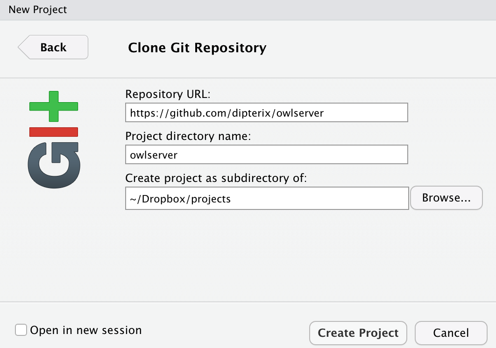

Objectives:

A guide to add stuff to this repository

Table of contents:

* [Prerequisites](#pre-requisite)
* [Get started](#get-started)


### Pre-requisite

This website is built using `rmarkdown`. Please check the [guide](https://www.markdownguide.org/getting-started) if you don't know how to edit `markdown` files. To add/edit pages, you need `git` to get access to Github and `rmarkdown` installed. Luckily, these can all be found in `RStudio`. 

### Get Started

*This part is one-time setup*

1. Open RStudio, create project via `File` > `New Project` > `Version Control` > `Git`. Copy-paste `https://github.com/dipterix/owlserver` into `Repository URL` and choose a proper directory.
<div style='width:45%'></div>
2. Switch to `Terminal` tab in Rstudio, enter your Github user credentials like this:
```
$ git config --global user.name "Bob"
$ git config --global user.email "bob@example.com"
```
3. Create your own folder in the project folder. In my case, it's called `zhengjia`. You can put all the static stuff here, like sample code, bash scripts or images that are ready to share.

### Create Your Pages

1. Create `.rmd` or `.md` file under **project** directory, for example, `example.rmd`. Any markdown files inside of sub-folders will not be compiled.
2. Edit the file just created, you can check [a simple cheatsheet]() and [source code]() as a reference
3. Pull, commit, and push to github: 
  * Go to `Git` tab in RStudio, select all files you want to save to Github, 
  * click `Commit`, add commit messages (description of what you did), 
  * press `commit`. If all goes well, you will see the following
  * Don't forget to press `Push`. This step actually send your local files to Github.
  <div style='width:45%'></div>

